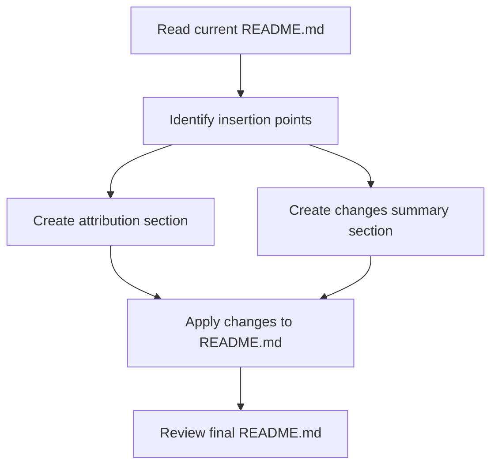

# Plan for Updating RooFlow README.md

## Overview
This plan outlines the changes needed to update the RooFlow README.md to properly attribute the work to GitHub user GreatScottyMac and document Emily's modifications to the global context.

## Current State
- The README.md already mentions GitHub user GreatScottyMac as the original author in several places
- It includes links to the original repository
- It already mentions the PowerShell scripts for applying RooFlow to existing projects and new projects

## Changes to Implement

### 1. Add Fork Notice Section
Add a section at the top of the README.md that clearly states:
- This is GitHub user GreatScottyMac's work
- Emily has made edits to the global context to work for her
- No upstream changes are intended
- A link to the original author's repository

Proposed content:
```markdown
# Fork Notice

This repository is a fork of [GreatScottyMac's RooFlow](https://github.com/GreatScottyMac/RooFlow) with personal modifications made by Emily. No upstream changes are intended. Please refer to the original repository for the canonical version.
```

### 2. Add Emily's Modifications Section
Add a section that summarizes Emily's changes:
- Custom instructions for language preference (English)
- Global instructions about interaction style (asking clarifying questions one at a time, etc.)
- Mode-specific instructions for the architect mode
- Added functionality for applying RooFlow to existing projects and new projects with PowerShell scripts

Proposed content:
```markdown
## Emily's Modifications

The following modifications have been made to the original RooFlow project:

- Added custom instructions for language preference (English)
- Added global instructions for interaction style:
  - Ask clarifying questions one at a time
  - Perform one step at a time
  - Prompt for manual actions
  - Use PowerShell syntax for terminal commands
  - Prompt to start a new task when API token cost nears $0.5
- Added mode-specific instructions for the architect mode
- Enhanced functionality for applying RooFlow to existing projects and new projects with PowerShell scripts
```

### 3. Implementation Approach
- Use the apply_diff tool to add the new sections at the top of the README.md
- Ensure the formatting is consistent with the rest of the document
- Maintain all existing content and links

## Implementation Flow



## Next Steps
1. Switch to Code mode to implement the changes
2. Use apply_diff to add the new sections to the README.md
3. Review the updated README.md to ensure all requirements are met