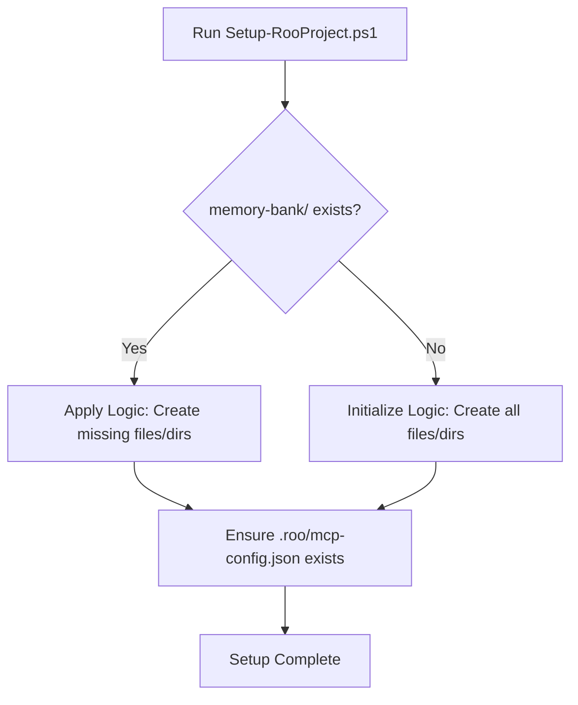

# Plan: Unified Roo Project Setup & Packaging

This plan outlines the steps to consolidate the Roo Memory System initialization scripts, correct configuration paths, and package the core components for easy deployment into new or existing projects, including a README for end-users.

## 1. Consolidate Scripts

*   **Action:** Create a new script: `scripts/Setup-RooProject.ps1`.
*   **Purpose:** This script will replace `Initialize-RooMemorySystem.ps1` and `Apply-RooMemorySystemToExisting.ps1`.
*   **Logic:**
    *   Check if `memory-bank/` exists in the target project path.
    *   **If `memory-bank/` exists:** Apply logic - create only missing structures (`memory-bank/archives`, `memory-archives`, `.roo`) and config files (`.roo/mcp-config.json`, `memory-bank/memory-config.json`, archive placeholders) without overwriting existing memory data.
    *   **If `memory-bank/` does NOT exist:** Initialize logic - create `memory-bank/` along with all other necessary structures and default config files.
*   **Parameter:** Accept an optional `-ProjectPath` parameter (string), defaulting to the current directory (`.`).

## 2. Correct MCP Config Path

*   **Action:** Modify `Setup-RooProject.ps1` during its creation.
*   **Change:** Ensure it creates/checks for `mcp-config.json` within the **`.roo/`** directory, not the project root.
*   **Default State:** The default `mcp-config.json` created by the script should have all servers disabled (`enabled: false`) and use placeholders for sensitive or environment-specific values (e.g., `<Specify path...>`, `<Optional: Environment variable name...>`).

## 3. Define "Roo Core" Package

*   **Action:** Identify and prepare the core files/folders for distribution.
*   **Contents:**
    *   `scripts/Setup-RooProject.ps1` (New)
    *   `scripts/Configure-McpServers.ps1` (Existing - check for path assumptions)
    *   `scripts/memory-manager.ps1` (Existing)
    *   `modules/McpHandler.psm1` (Existing - check for path assumptions)
    *   `.roo/` (Optional: Default system prompts, `.roomodes` - **ensure no personal data**)
    *   `README.md` (New)
*   **Constraint:** Verify that no personal secrets (API keys, user-specific paths) are hardcoded in any distributed files. Use placeholders and environment variables.

## 4. Create README.md

*   **Action:** Create a `README.md` file at the root of the "Roo Core" package.
*   **Content Outline:**
    *   **Purpose:** Explain Roo Memory System and MCP integration.
    *   **Prerequisites:** List necessary software (e.g., PowerShell).
    *   **Setup Steps (Windows):**
        1.  Instruct user to copy "Roo Core" files into their project root.
        2.  Instruct user to open PowerShell in the project root.
        3.  Provide the command: `.\scripts\Setup-RooProject.ps1`
        4.  Explain the script's outcome (creates structure/configs).
    *   **Configuration:**
        1.  Explain the need for environment variables (recommend `.env` file).
        2.  List example environment variables needed for default MCP servers (e.g., `BRAVE_SEARCH_API_KEY`, `GIT_PAT`). **Stress these are examples and require user's own keys.**
        3.  Instruct user to run `.\scripts\Configure-McpServers.ps1` for interactive enabling/configuration of MCP servers.
    *   **Usage:** Briefly describe how Roo uses the system.

## 5. Initialization Trigger

*   **Method:** The primary setup trigger is manual execution of `.\scripts\Setup-RooProject.ps1` by the user after placing the "Roo Core" files.

## 6. Cleanup

*   **Action:** After `Setup-RooProject.ps1` is created, tested, and confirmed functional, delete the old scripts:
    *   `scripts/Initialize-RooMemorySystem.ps1`
    *   `scripts/Apply-RooMemorySystemToExisting.ps1`

## Diagrams

**Setup Logic:**



**Setup & Configuration Flow for New User:**

```mermaid
graph TD
    subgraph User Actions
        A[Copy "Roo Core" files to project] --> B[Run Setup-RooProject.ps1];
        B --> C[Create/Update .env file with API keys];
        C --> D[Run Configure-McpServers.ps1];
        D --> E[Enable/Configure desired MCP servers];
    end
    subgraph Script Actions
        B -- Creates/Checks --> F[Project Structure: memory-bank/, .roo/, etc.];
        F -- Creates/Checks --> G[Default .roo/mcp-config.json (servers disabled)];
        D -- Reads --> C;
        D -- Modifies --> G;
    end
    E --> H[Roo System Ready];